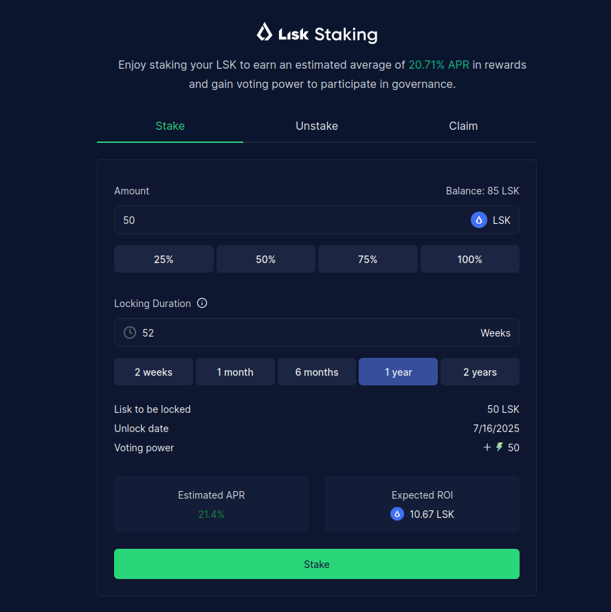

:::info
In order to stake you need a minimum of 0.01 LSK
:::

## How to stake your LSK tokens

1. **Go to the `Stake Tokens` page** on the Lisk Portal: → https://portal.lisk.com/staking/stake ←  
  Fill out the form as described in the following steps to complete the staking process.
  
2. **Enter the amount of LSK you wish to stake.**
3. **Set the locking period.**
4. **Approve the staking.**
5. **Create the locking position.**

That's it! 🎉 You have now successfully taked your LSK tokens.

As you can see on your staking dashboard, you receive voting power in the Lisk DAO and staking rewards, proportional to your staked amount and locking duration.

In order to use your voting power to participate in the decentralized governance of Lisk, make sure to [Delegate your voting power](/governance/delegation) to yourself or a delegate of your choice.

After some time, you should see an accumulated amount of your staking rewards you received until then.
Check out the next section to learn how to claim your rewards.

## How to claim staking rewards

1. **Go to the `Stake Tokens` page** on the Lisk Portal: → https://portal.lisk.com/staking/stake ← 
2. **Click on the `Claim` tab.**
3. **Click the `CLaim Rewards` button.**
4. **Verify your rewards ready to be claimed.**
5. **Click the `CLaim Rewards` button.**

## How to unstake your LSK tokens

If you wish to unstqke your staked LSK in order to use them for different purposes, please follow this process:

:::caution
LSK tokens can only be unstaked, if the locking period of the staked tokens has expired.
:::

1. **Go to the `Stake Tokens` page** on the Lisk Portal: → https://portal.lisk.com/staking/stake ← 
2. **Click on the `Unstake` tab.**
3. **Select the expired locking position** you wish to unstake.

